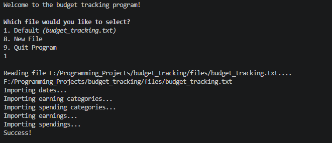
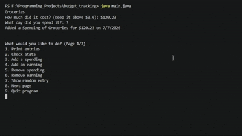
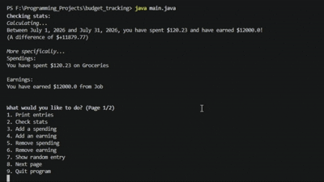
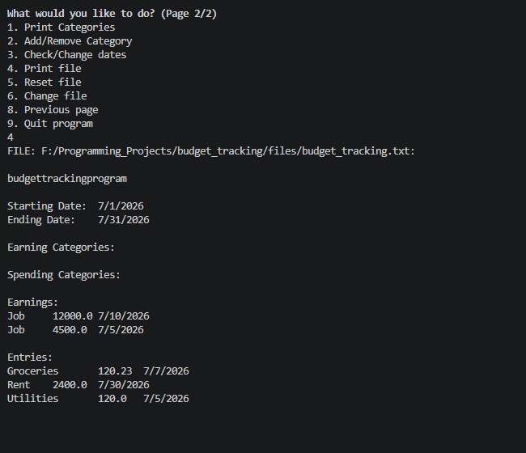
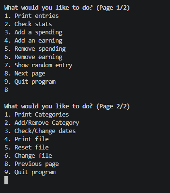

# budget_tracking
A budget tracking program, utilized via a termiminal.

*Created in Java*

### To run program:
`$ make`

### To cleanup:
`$ make cleanup`

### To cleanup data files:
`$ make cleanupfiles`

 
    
    
    
    
    
    

*Written by Sam Lowry, 2022*
